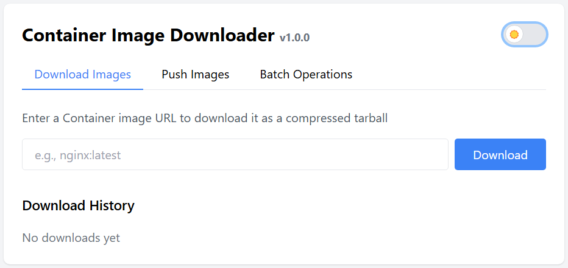
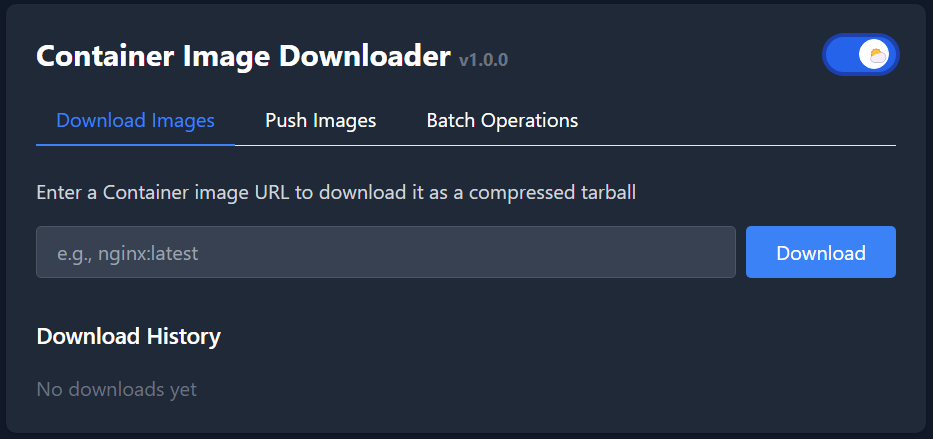
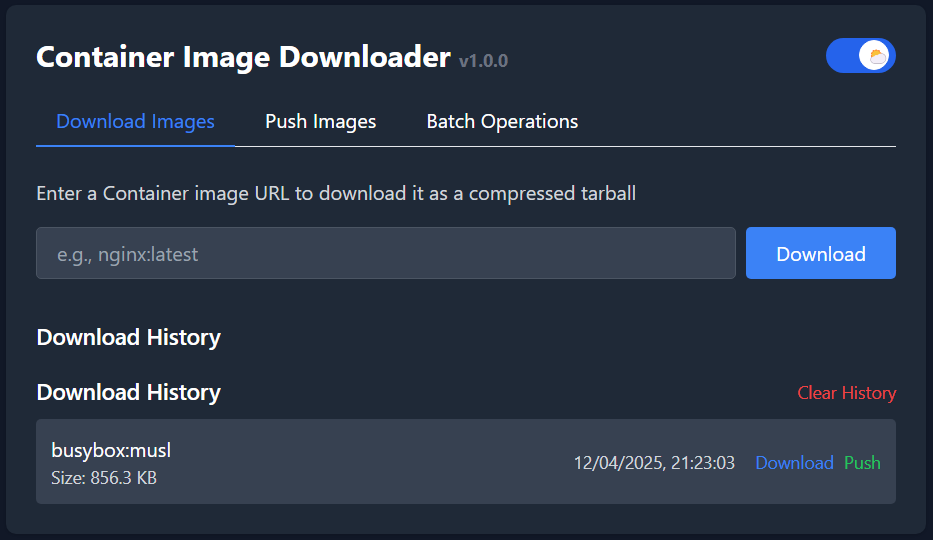
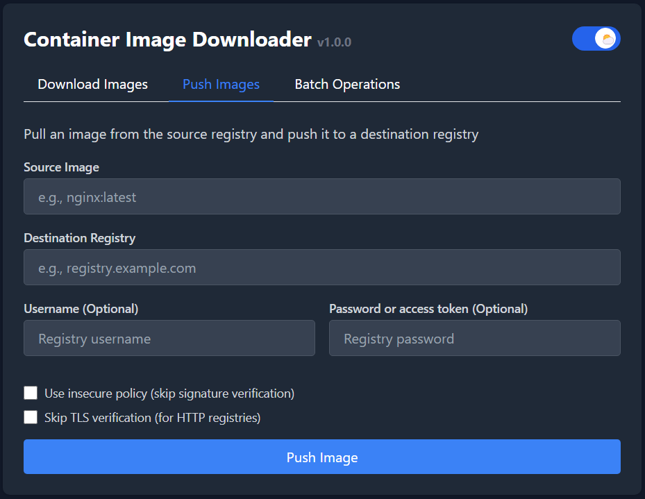
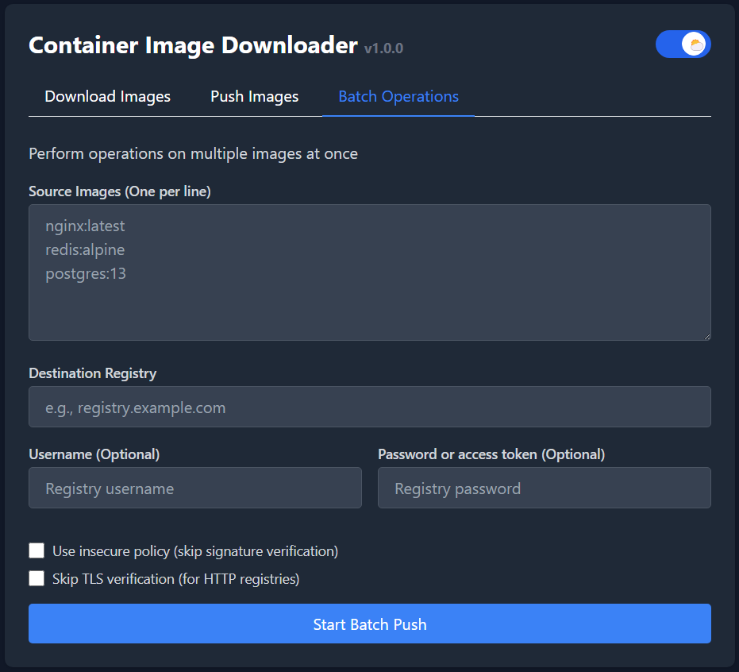

# Container Image Downloader (CID)

A lightweight web application for downloading, pushing, and batch processing container images across registries.


## Features

- **Download Images**: Pull container images and save them as compressed tarballs
- **Push Images**: Transfer images between registries with authentication support  
- **Batch Operations**: Process multiple images in a single operation
- **Simple Interface**: Clean web UI with no dependencies
- **Secure**: Support for authenticated registry access

## Screenshots







## Requirements

- Python 3.12+
- Skopeo (for container image operations)

## Quick Start

### Using Docker compose (Recommended)

```bash
git clone https://github.com/WatskeBart/cid.git
cd cid
docker compose up -d
```

#### Manual Docker run image

Each release will have a pre-built image available in this repository.

```bash
docker run --name cid -p 8008:8008 -d ghcr.io/watskebart/cid:latest
```

>Access the application at http://localhost:8008

### Manual Installation

1. Clone the repository:

```bash
git clone https://github.com/WatskeBart/cid.git
cd cid
```

2. Create and activate a virtual environment:

```bash
python3 -m venv venv
source venv/bin/activate  # On Windows: venv\bin\Activate.ps1
```

3. Install dependencies:

```bash
pip install -r requirements.txt
```

4. Install Skopeo on your system:

   - Ubuntu/Debian: `apt-get install skopeo`
   - RHEL/CentOS: `dnf install skopeo`
   - Alpine: `apk add skopeo`
   - MacOS: `brew install skopeo`
   - Windows: [winskopeo](https://github.com/passcod/winskopeo) (Not tested by me!)

5. Start the application:

```bash
python3 app.py
```

The application will be available at http://localhost:8008

### Rebuilding Tailwind CSS

The application uses Tailwind CSS for styling. The build CSS ensures that this application also operates correctly without a internet connection.\
To rebuild the CSS:

1. Install the Tailwind CSS CLI globally:

```bash
npm install -g tailwindcss
```

>Alternatively, you can download a binary from the [Tailwind Github repository](https://github.com/tailwindlabs/tailwindcss/releases)

2. Rebuild the CSS:

```bash
tailwindcss -i ./static/src/tailwind.css -o ./static/css/main.css # Development builds

tailwindcss -i ./static/src/tailwind.css -o ./static/css/main.css --minify # Production builds

tailwindcss -i ./static/src/tailwind.css -o ./static/css/main.css --watch # Development build with auto-reload on changes
```

## Configuration

The application can be configured using environment variables:

| Variable | Description | Default |
|----------|-------------|---------|
| `FLASK_ENV` | Local development `python3 app.py` | `debug` |
| `FLASK_ENV` | Container image `docker compose up -d` | `production` |
| `HOST` | Host address to bind to | `0.0.0.0` |
| `PORT` | Port number | `8008` |

## Usage Guide

### Downloading Images

1. Enter the image URL in the format `repository/image:tag` (e.g., `nginx:latest`)
2. Click "Download" to save the compressed tarball
3. Previous downloads will appear in the history section for quick re-downloading or push to another registry

### Pushing Images

1. Enter the source image URL in the format `repository/image:tag` (e.g. `nginx:latest`)
2. Specify the destination registry URL (e.g. `mylocalregistry:5000` or `ghcr.io/yourusername/reponame`)
3. Provide authentication credentials if required
4. Select TLS and policy options as needed
5. Click "Push Image" to transfer the image

### Batch Operations

1. Enter multiple image URLs (one per line), in the format `repository/image:tag` (e.g. `nginx:latest`)
2. Specify the destination registry URL (e.g. `mylocalregistry:5000` or `ghcr.io/yourusername/reponame`)
3. Provide authentication credentials if required
4. Select TLS and policy options as needed
5. Click "Start Batch Push" to process all images
6. Review the detailed results showing success/failure for each image

## Security Considerations

- All credentials are only used for registry authentication and are never stored server-side
- TLS verification can be disabled for testing environments (not recommended for production)
- Container signature verification can be bypassed with the insecure policy option
- The application follows security best practices with appropriate HTTP headers

## Development

### Project Structure

```markdown
├── app.py                # Main application logic
├── templates/            # HTML templates
│   └── index.html        # Single-page web interface
├── static/               # Static assets
│   ├── css/              # Generated CSS
│   │   └── main.css      # Compiled Tailwind CSS
│   └── src/              # Source files
│       └── tailwind.css  # Tailwind directives
├── logs/                 # Application logs (created at runtime)
├── docker-compose.yml    # Docker Compose configuration
├── Dockerfile            # Docker image definition
├── requirements.txt      # Python dependencies
├── tailwind.config.js    # Tailwind CSS configuration
└── README.md             # This file
```

### Contributing

Contributions are welcome! Please feel free to submit a Pull Request.

1. Fork the repository
2. Create your feature branch (`git checkout -b feature/amazing-feature`)
3. Commit your changes (`git commit -m 'Add some amazing feature'`)
4. Push to the branch (`git push origin feature/amazing-feature`)
5. Open a Pull Request

## Troubleshooting

### Common Issues

- **"Error downloading image"**: Ensure Skopeo is installed and the image URL is correct
- **"Error pushing image"**: Verify registry credentials and connectivity
- **Slow downloads**: Some container images can be large. Be patient with multi-gigabyte images.

### Logs

Logs are stored in the `logs/` directory when running in production mode.

## License

This project is licensed under the BSD 3-Clause License - see the [LICENSE](LICENSE) file for details.

## Acknowledgments

- [Skopeo](https://github.com/containers/skopeo) for container image operations
- [Flask](https://flask.palletsprojects.com/) for the web framework
- [TailwindCSS](https://tailwindcss.com/) for the UI styling